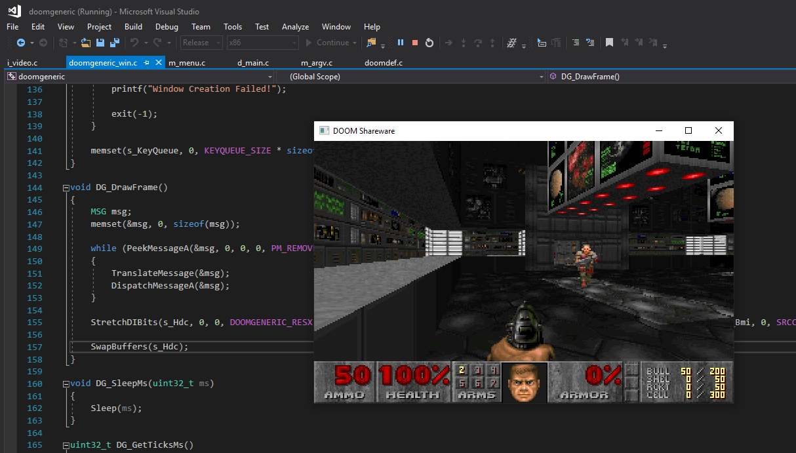
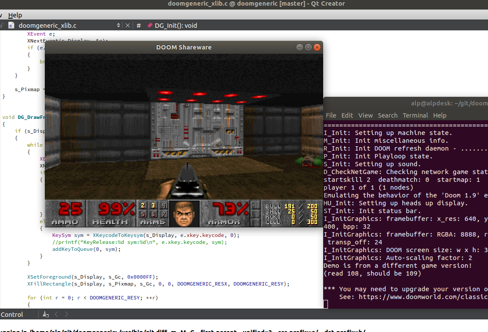
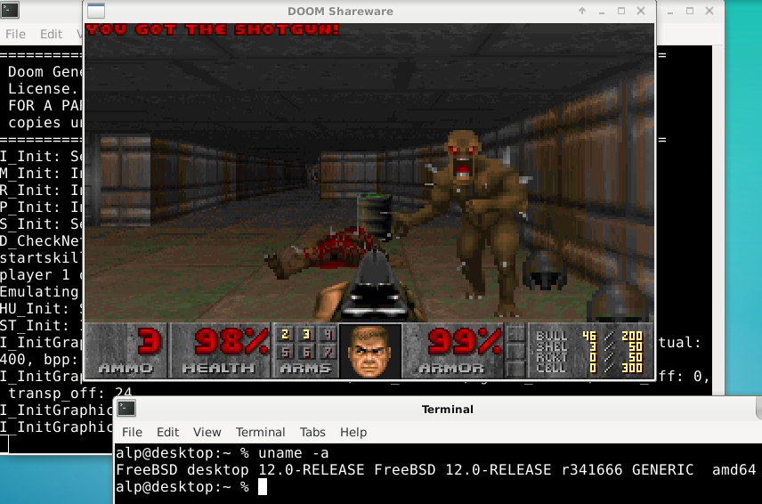
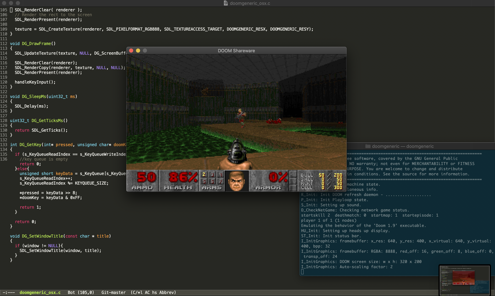

# doomgeneric

## Neutrino package

This checkout includes a native Neutrino port and package definition. It uses
Neutrino's graphical-session, framebuffer, keyboard, wall-clock, virtual
memory, and filesystem syscalls directly; it has no hosted libc dependency.

Build the executable and the installable package with:

```sh
make package
```

The build produces `out/doom.elf` and `out/doom.zip`. Install the ZIP with
Neutrino's package manager:

```text
neupak install-local /path/to/doom.zip
```

Doom's commercial game data is not included. Copy an IWAD that you own, or an
open IWAD such as `freedoom1.wad`, to a Neutrino filesystem and launch:

```text
doom -iwad /path/to/freedoom1.wad
```

When the Neutrino desktop is running, Doom opens as a focused, draggable
320x200 window. Outside the desktop it falls back to its fullscreen graphical
session backend. The desktop launcher path and default WAD arguments are
configured in `/config/desktop.cfg`.

The port currently provides scaled 320x200 graphics, keyboard input, mixed
sound effects, and basic synthesized music through Neutrino's 48 kHz Intel HDA
PCM output. The music backend reads Doom's MUS data directly and uses a small
built-in MIDI-style synthesizer; it does not need a SoundFont, though its
instrument sounds are intentionally simple. Mouse, joystick, and networking
are not implemented. Standard Doom keyboard controls work: Ctrl fires, Space
uses/opens, Alt modifies movement into strafing, and Escape opens the menu.
Fatal game-data errors are also written to `doom-error.log` in the directory
from which Doom was launched.

## Upstream project

The purpose of doomgeneric is to make porting Doom easier.
Of course Doom is already portable but with doomgeneric it is possible with just a few functions.

To try it you will need a WAD file (game data). If you don't own the game, shareware version is freely available (doom1.wad).

# porting
Create a file named doomgeneric_yourplatform.c and just implement these functions to suit your platform.
* DG_Init
* DG_DrawFrame
* DG_SleepMs
* DG_GetTicksMs
* DG_GetKey

|Functions            |Description|
|---------------------|-----------|
|DG_Init              |Initialize your platfrom (create window, framebuffer, etc...).
|DG_DrawFrame         |Frame is ready in DG_ScreenBuffer. Copy it to your platform's screen.
|DG_SleepMs           |Sleep in milliseconds.
|DG_GetTicksMs        |The ticks passed since launch in milliseconds.
|DG_GetKey            |Provide keyboard events.
|DG_SetWindowTitle    |Not required. This is for setting the window title as Doom sets this from WAD file.

### main loop
At start, call doomgeneric_Create().

In a loop, call doomgeneric_Tick().

In simplest form:
```
int main(int argc, char **argv)
{
    doomgeneric_Create(argc, argv);

    while (1)
    {
        doomgeneric_Tick();
    }
    
    return 0;
}
```

# sound
Sound is much harder to implement! If you need sound, take a look at SDL port. It fully supports sound and music! Where to start? Define FEATURE_SOUND, assign DG_sound_module and DG_music_module.

# platforms
Ported platforms include Windows, X11, SDL, emscripten. Just look at (doomgeneric_win.c, doomgeneric_xlib.c, doomgeneric_sdl.c).
Makefiles provided for each platform.

## emscripten
You can try it directly here:
https://ozkl.github.io/doomgeneric/

emscripten port is based on SDL port, so it supports sound and music! For music, timidity backend is used.

## Windows


## X11 - Ubuntu


## X11 - FreeBSD


## SDL

